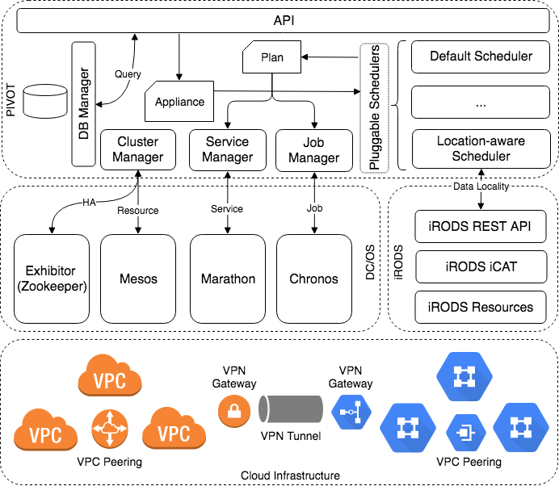

Helium DataCommons PIVOT
========================
### Architecture



### Deployment
The service consists of two micro-services - a web server and a MongoDB
database.

To launch the database, send the request body below to Marathon:

```
{
  "id": "/sys/pivot",
  "instances": 1,
  "cpus": 1,
  "mem": 1024,
  "container": {
    "type": "DOCKER",
    "volumes": [
      {
        "containerPath": "/data/db",
        "hostPath": "/data/pivot_db",
        "mode": "RW"
      }
    ],
    "docker": {
      "image": "heliumdatacommons/mongodb",
      "privileged": false,
      "parameters": [],
      "forcePullImage": true
    }
  },
  "networks": [
    {
      "mode": "host"
    }
  ],
  "portDefinitions": [],
  "requirePorts": false
  "upgradeStrategy": {
    "minimumHealthCapacity": 0,
    "maximumOverCapacity": 0
  }
}
```

The database listens on port `27017` by default and it is only
accessible internally within the virtual overlay network.

The request body for deploying PIVOT on Marathon is as below:

```json
{
  "id": "/sys/pivot-db",
  "instances": 1,
  "cpus": 2,
  "mem": 2048,
  "disk": 4096,
  "args": [
    "--master",
    "<master-private-ip-addr>"
    "--port",
    "9191",
    "--n_parallel",
    "2",
     "--db_host",
    "pivot-db-sys.marathon.containerip.dcos.thisdcos.directory"
  ],
  "container": {
    "type": "DOCKER",
    "volumes": [

    ],
    "docker": {
      "image": "heliumdatacommons/pivot",
      "privileged": false,
      "parameters": [

      ],
      "forcePullImage": true
    }
  },
  "networks": [
    {
      "mode": "host"
    }
  ],
  "portDefinitions": [
    {
      "labels": {
        "VIP_0": "/pivot:9191"
      },
      "protocol": "tcp",
      "port": 9191
    }
  ],
  "requirePorts": true,
  "healthChecks": [
    {
      "gracePeriodSeconds": 300,
      "intervalSeconds": 60,
      "maxConsecutiveFailures": 3,
      "portIndex": 0,
      "timeoutSeconds": 20,
      "delaySeconds": 15,
      "protocol": "MESOS_HTTP",
      "path": "/ping"
    }
  ],
  "upgradeStrategy": {
    "minimumHealthCapacity": 0,
    "maximumOverCapacity": 0
  },
  "labels": {
    "DCOS_SERVICE_SCHEME": "http",
    "DCOS_SERVICE_NAME": "pivot",
    "DCOS_PACKAGE_FRAMEWORK_NAME": "pivot",
    "DCOS_SERVICE_PORT_INDEX": "0"
  }
}

```

Note that the private IP address of the leader Mesos master needs to be
specified as a part of the arguments (`<master-private-ip-addr>`)
in the request.

Besides, as the web server needs to interact with the
database, the internal FQDN of the database needs to be specified. The
internal FQDN is formatted as
`<service-name>-<group-name>.marathon.containerip.dcos.thisdcos.directory`.
For example, if the service is named as `/foo/bar`, its FQDN is
`foo-bar.marathon.containerip.dcos.thisdcos.directory`.


With curl, a typical deployment command is as below
(assuming the request body is saved to a file named `pivot.json`):

```shell
curl -X PUT \
    -H "Content-Type: application/json"  \
    -d @pivot.json \
    http://<marathon-host>:<marathon-port>/v2/apps
```

By default, Marathon listens on port `8080`.

**Note:** The Marathon endpoint is typically protected behind a firewall
and cannot be reached outside the virtual network of DC/OS. Therefore,
to deploy PIVOT, you need to ask the administrator of the DC/OS
cluster to either punch a hole on the firewall for you do the deployment
remotely, or add you as a SSH user to one of the masters to deploy it
locally.

To pin the service onto a specific node, add the `constraints` field in
the request body as below:

```json
{
  ...
  "constraints": [
    [ "hostname", "CLUSTER", "10.52.100.4"]
  ]
  ...
}
```

**Note:** that the hostname is just the private IP address of the DC/OS
agent where PIVOT will land, since DC/OS identifies the agents by their
private IP addresses.


### Tutorials
1. [Running CWL Workflow Launcher](examples/cwl.md)
2. [Running Sparkmagic, Livy and Spark](examples/sparkmagic.md)
3. [Running Containerized Mesos Cluster](examples/mesos.md)
