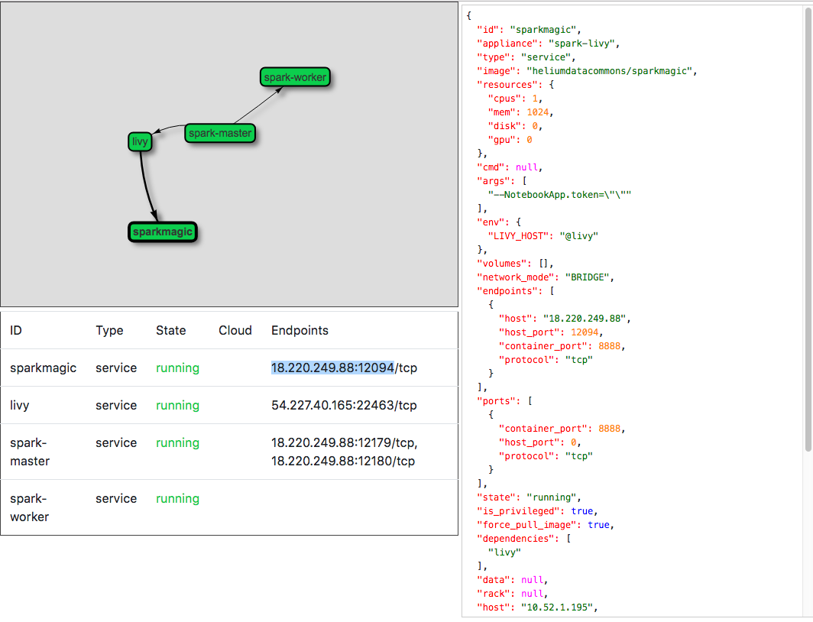
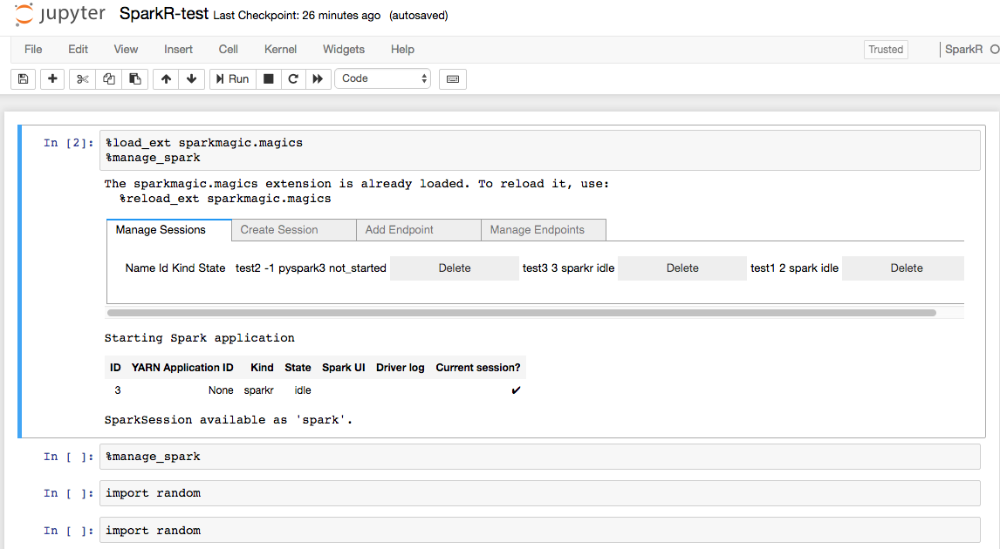

Running Sparkmagic, Livy and Spark with PIVOT
=============================================
This appliance consists of a [Jupyter notebook](http://jupyter.org/)
container with [Sparkmagic](https://github.com/jupyter-incubator/sparkmagic),
a [Livy](https://livy.incubator.apache.org/) endpoint and a Spark
cluster. The Spark cluster is running in the
[standalone mode](https://spark.apache.org/docs/latest/spark-standalone.html),
which consists of a master and a number of workers. Hence, there are
four containers in the appliance - a Sparkmagic Jupyter notebook, a Livy
endpoint, a Spark master and an arbitrary number of Spark workers.

The Livy endpoint uses the `heliumdatacomons/livy` image and exposes
port `8998` on the container for HTTP requests from users. Besides, it
also needs to reach the Spark master to run jobs on the Spark cluster.
The `heliumdatacommons/livy` image takes one argument of the URL of the
Spark master. The Livy endpoint container is specified as below:

```json
{
    "id": "livy",
    "type": "service",
    "image": "heliumdatacommons/livy",
    "resources": {
        "cpus": 1,
        "mem": 4096
    },
    "network_mode": "container",
    "ports": [
        { "container_port": 8998 }
    ],
    "args": [
        "spark://@spark-master:7077"
    ],
    "dependencies": [ "spark-master" ]
}
```

**Note:** Livy requires a minimum of 2GB RAM to function normally and
allow multiple active sessions simultaneously. Otherwise the sessions
will run out of memory very soon and exit unexpectedly without traceable
log. It has been tested that 6 active sessions can be created with 4GB
RAM allocated.

The Sparkmagic Jupyter notebook runs on top of the Livy endpoint to
interact with the Spark cluster underneath as specified below:

```json
{
    "id": "sparkmagic",
    "type": "service",
    "network_mode": "bridge",
    "image": "heliumdatacommons/sparkmagic",
    "resources": {
        "cpus": 1,
        "mem": 2048
    },
    "is_privileged": true,
    "ports": [
      {"container_port": 8888 }
    ],
    "args": [
      "--NotebookApp.token=\"\""
    ],
    "env": {
        "LIVY_HOST": "@livy"
    },
    "dependencies": [ "livy" ]
}
```

It  uses the `heliumdatacommons/sparkmagic` image and can read the value
of the optional environment variable `LIVY_HOST`, so that it can set up
the Livy endpoint in the Sparkmagic configuration.

The Spark master manages all the resources on the Spark workers for
running jobs. It exposes two ports - port `7077` for Spark messages and
port `8080` for HTTP requests. The status of the cluster can be checked
in the browser by visiting the `8080` port. The container uses the
`heliumdatacommons/spark-master` image. An example of a Spark master is
shown below:

```json
{
    "id": "spark-master",
    "type": "service",
    "image": "heliumdatacommons/spark-master",
    "resources": {
        "cpus": 1,
        "mem": 1024
    },
    "network_mode": "container",
    "ports": [
        { "container_port": 8080 }
        { "container_port": 7077 }
    ]
}
```

The Spark workers provide the resources. It uses the
`heliumdatacommons/spark-worker` image and needs to connect to the Spark
master. The Spark workers can scale up and down horizontally by
increasing and decreasing its number of `instances`, respectively. An
example of the Spark workers is as below:

```json
{
    "id": "spark-worker",
    "type": "service",
    "image": "heliumdatacommons/helium-spark-r-worker",
    "instances": 1,
    "resources": {
        "cpus": 4,
        "mem": 4096
    },
    "network_mode": "container",
    "args": [
        "@spark-master:7077"
    ],
    "env": {
        "PYSPARK_PYTHON": "/usr/bin/python"
    }
}
```

The containers do have dependencies on each other - the Livy endpoint
and Spark workers should run after the Spark master is running. To
ensure the containers are provisioned in order, the dependencies
between them should be specified explicitly in the `dependencies` field
on each container. By putting them together, the appliance looks like
below:

```json
{
    "id": "spark-livy",
    "containers": [
        {
            "id": "livy",
            "type": "service",
            "image": "heliumdatacommons/livy",
            "resources": {
                "cpus": 1,
                "mem": 4096
            },
            "network_mode": "container",
            "ports": [
                { "container_port": 8998 }
            ],
            "args": [
                "spark://@spark-master:7077"
            ],
            "dependencies": [ "spark-master" ]
        },
        {
            "id": "spark-master",
            "type": "service",
            "image": "heliumdatacommons/spark-master",
            "resources": {
                "cpus": 1,
                "mem": 1024
            },
            "network_mode": "container",
            "ports": [
                { "container_port": 8080 }
                { "container_port": 7077 }
            ]
        },
        {
            "id": "spark-worker",
            "type": "service",
            "image": "heliumdatacommons/helium-spark-r-worker",
            "instances": 1,
            "resources": {
                "cpus": 4,
                "mem": 4096
            },
            "network_mode": "container",
            "args": [
                "@spark-master:7077"
            ],
            "env": {
                "PYSPARK_PYTHON": "/usr/bin/python"
            }
        }
    ]
}
```

To run the appliance, submit the request to PIVOT using a `POST` method
as below:

```shell
curl -X POST -d @appliance.json http://<pivot-url>:<pivot-port>/appliance
```

To get the state of the appliance, query against PIVOT using a `GET`
method as below:

```shell
curl -X GET http://<pivot-url>:<pivot-port>/appliance/spark-livy
```

The response contains the information about the endpoints where users
can interact with the containers. For instance, users can visit the
Livy endpoint at http://13.58.175.56:23917 according to the endpoint
information of the livy container.

```json
{
    "id": "spark-livy",
    "containers": [
        {
            "id": "sparkmagic",
            "endpoints": [
                {
                    "host": "18.220.249.88",
                    "host_port": 12094,
                    "container_port": 8888,
                    "protocol": "tcp"
                }
            ],
            "state": "running",
            ...
        },
        {
            "id": "livy",
            "endpoints": [
                {
                    "host": "54.227.40.165",
                    "host_port": 22463,
                    "container_port": 8998,
                    "protocol": "tcp"
                }
            ],
            "state": "running",
            ...
        },
        {
            "id": "spark-master",
            "endpoints": [
                {
                    "host": "18.220.249.88",
                    "host_port": 12179,
                    "container_port": 8080,
                    "protocol": "tcp"
                },
                {
                    "host": "18.220.249.88",
                    "host_port": 12180,
                    "container_port": 7077,
                    "protocol": "tcp"
                }
            ],
            "state": "running",
            ...
        },
        {
            "id": "spark-worker",
            "state": "running",
            ...
        }
    ]
}
```

To delete the state of the appliance:

```
curl -X DELETE http://<pivot-url>:<pivot-port>/appliance/spark-livy
```

The visual of the appliance can be found at
`http://<pivot-url>:<pivot-port>/appliance/spark-livy/ui`, which looks
as below:



Visit the Sparkmagic endpoint in the browser and then you can create
Spark sessions.


